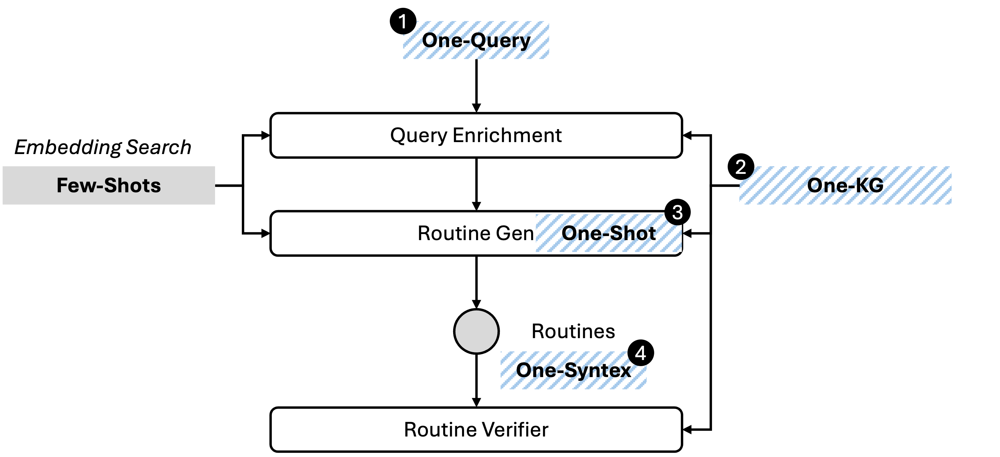

# 4onebench
Routine-Gen is a crucial part for LLM-based agents, enabling them to effectively orchestrate IT assets, such as APIs, to accomplish tasks. 

However, there is a lack of systems to evaluate the effectiveness of LLMs in routine generation in a business context. 

The purpose of **4-One Bench** is to create a lightweight evaluation system that can help users quickly assess the Routine-Gen capabilities of LLMs. 

## Features and Architecture
The architecture of 4-One Bench utilize a **Generator-Verifier** design pattern. In this setup, the **Generator** converts tasks into routines based on predefined knowledge graphs , while the **Verifier** employs LLMs to validate generated.routines  

Furthermore, the evaluation system has 4 "One" features:



### One-Query
Our dataset includes 51 "one-sentence tasks". 

### One-Knowledge Graph
Based on the tasks, a knowledge graph that describes IT asset relationships will guide LLMs to generate routines. Additionally, users can define their own knowledge graph.

### One-Shot
Considering the critical factors of response time and accuracy in real business environments, 4-One Bench only evaluates the likelihood that LLMs can successfully generate a Routine in a single attempt.

### One-Syntax
4-One Bench has developed a proprietary syntax for defining the orchestration of IT assets. Users also have the flexibility to create their own custom syntax.

## Demo
## Launch the evaluation
1. Create and activate a new virtual environment 
```bash
python -m venv clean_env
source clean_env/bin/activate
```

2. Install dependencies
```bash
pip install -r requirement.txt
```

3. Use the following script to launch the evaluation:

```bash
% streamlit run app/app.py
```

## License

This project is licensed under the Apache License 2.0. See the [LICENSE](./LICENSE) file for details.
